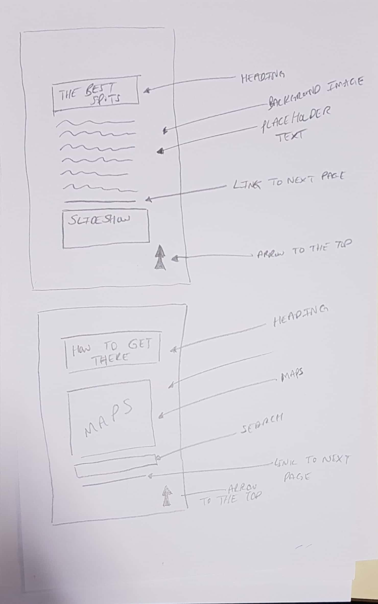

# Where To Smoke
The website is about some of the best places to smoke shisha in leicester. The website has been designed as a single page app in a parrallax way as this is a modern way in which websites are created. This can be seen when clicking a link a whole new page is not loaded but the page scrolls down to the relvant information. The first section would be an introduction to the website, detailing that this is a page about the best places to smoke shisha, the next section would be about the best spots. logically anyone after seeing the best spots and considering going for shisha in leicester will wonder where these "best spots" are so the next section is where they are and the final section is a contact us for possible suggestions that may have been missed.

# Wireframes
## Mobile View

## Desktop

# Issues

The biggest issue was deciding what to do. As you can see in the failed attempts branch on github there were some attempts before getting to the final product.

HTML did not produce many errors, but many of the errors were the same. There were 4 warnings where I had used a section without a h2-h6 tag. The main error was due to the alt attribute in the images being left empty. This was easily fixed by editing the HTML and adding in some text to describe what the picture is. I learnt from my research that this aids blind people as the text to speech application that they may use will describe that there is an image of "the alt information"

The CSS Validator was producing a parse error. This was because of a missing ";" in the code which was causing this error. This was fixed but showed the importance of a single missed syntax. This had not broken the website but was causing it be unexpectedly laid out.

JavaScript Error in console because when running on chrome, google says this is a bug in the validator and edge and mozilla run without this error. Another error on the live github link is that the svg image links are not "https" therefore it is giving a "mixed content" error

# User Testing
I had Ubayd Al Aghmarty, Musab Belahouel and Mohammed Kharodia test the website, checking each link and button to ensure they were taking them to where they were clicking. I asked that they thoroughly test this and Ubayd noted that under 309px that some text would overlap. He advised that it would be a good idea to remedy this. Musab recommended that the contact form at the bottom could print a message to say message sent. Mohammed Kharodia advised that it was tedious to scroll to the top every time you got the bottom and a quick button to take the user to the top would help.

# PARC and Accesibility
The colour scheme was kept consistent throughout. It is clear there are 2-3 main colours across the website which keep the level of consistency.
The colours chosen were gray white and dark gray this was because they contrast with each other well and make each other stand out.
I have kept the sizing the same aswell and made sure their proximity i.e how close similar content is to each other. was in line with its definition
I also repeated certain colours and themes to ensure that the the user had the best experience possible.

In regards to accessibility there were many things implemented to ensure that there was ease of access for the masses. One of these were the alt tags in the images so that a blind person would be able to navigate around the website better. Another was the language choice to cater for many different languages as Leicester is a very diverse place. Another was the implementation of a button to take the user back to the top of the page. All these things combined helped with better accessibility and a better user experience.

# references
code amended to suit the purposes of the website from W3Schools, Codepen and Labs. Some references have been listed below where chunks of code were borrowed or tools were used to help make the website.

https://validator.w3.org/
https://jigsaw.w3.org/css-validator
https://codepen.io/cutiealice/pen/eZMXLj
https://codepen.io/rexkirby/pen/Fdnlz?q=responsive+form&limit=all&type=type-pens
https://www.youtube.com/watch?v=JttTcnidSdQ&list=PLillGF-RfqbZTASqIqdvm1R5mLrQq79CU&index=7
https://www.w3schools.com/howto/howto_css_social_media_buttons.asp
https://ezgif.com/resize/ezgif-5-6ea08b2ee9.gif
https://codepen.io/planetgrafix/pen/iGDrk?q=slideshow&limit=all&type=type-pens
https://stackoverflow.com/questions/12243818/adding-google-translate-to-a-web-site

